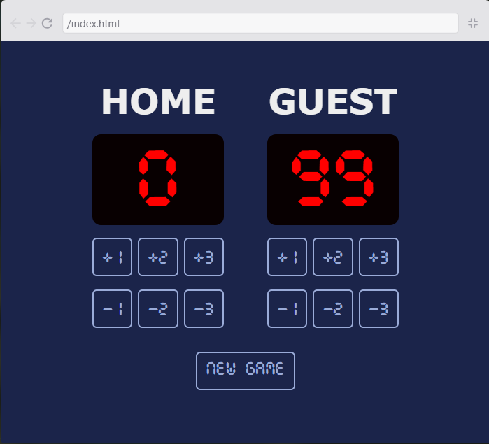

# Basketball Scoreboard

Veja também em [Português](./README.md)

## Description

A basketball scoreboard made with HTML, CSS and JavaScript. Being part of the solo project "Basketball Court" at the [Scrimba](https://scrimba.com/) platform. Developed in the Front-End Developer Course.

## Resources

- Interface that adjusts with the screen size
- 6 buttons for every scoreboard
  - +1 Point, +2 Points, +3 Points
  - -1 Points, -2 Points, -3 Points
- New Game button
- Points limiter in JavaScript

> [!NOTE]
> The limiter avoids any value under 0 and higher than 99

## Images

Website Appearance in a Big Screen:

Website Appearance in a Small Screen:

