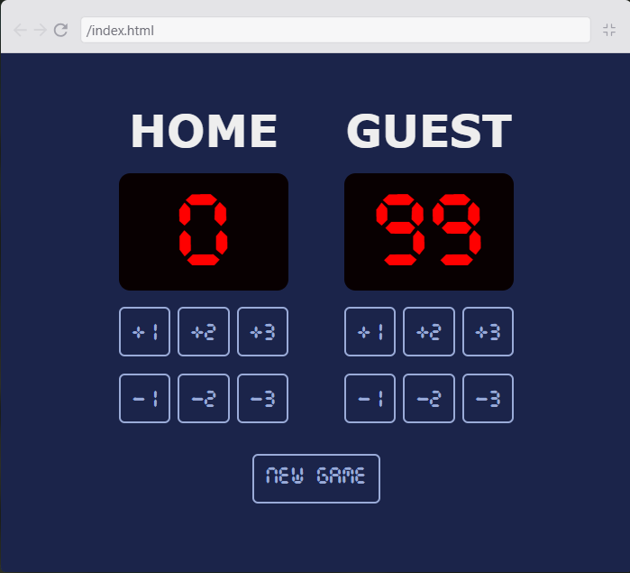
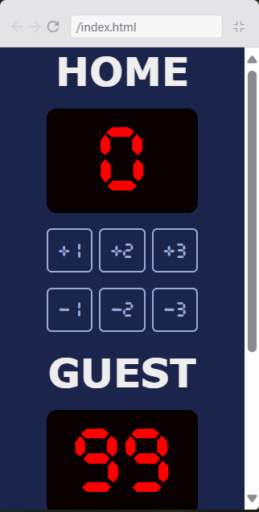

# Placar de Pontuação de Basquete

See also in [English](./README-EN.md)

## Descrição

Um placar de basquete feito com HTML, CSS e JavaScript. Fazendo parte do projeto solo "Basketball Court" na plataforma [Scrimba](https://scrimba.com/). Desenvolvido no curso de Desenvolvedor Front-End.

## Recursos

- Interface que se ajusta com o tamanho da tela
- 6 botões funcionais para cada placar
  - +1 Ponto, +2 Pontos, +3 Pontos
  - -1 Ponto, -2 Pontos, -3 Pontos
- Botão de Novo Jogo
- Limitador de pontos em JavaScript

> [!NOTE]
> O limitador evita valores menores que zero e maiores que 99

## Imagens

Aparência do Website em uma Tela Larga:

Aparência do Website em uma Tela Pequena:

